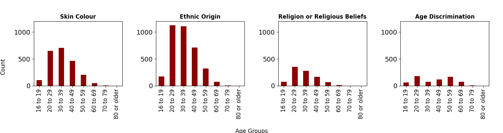
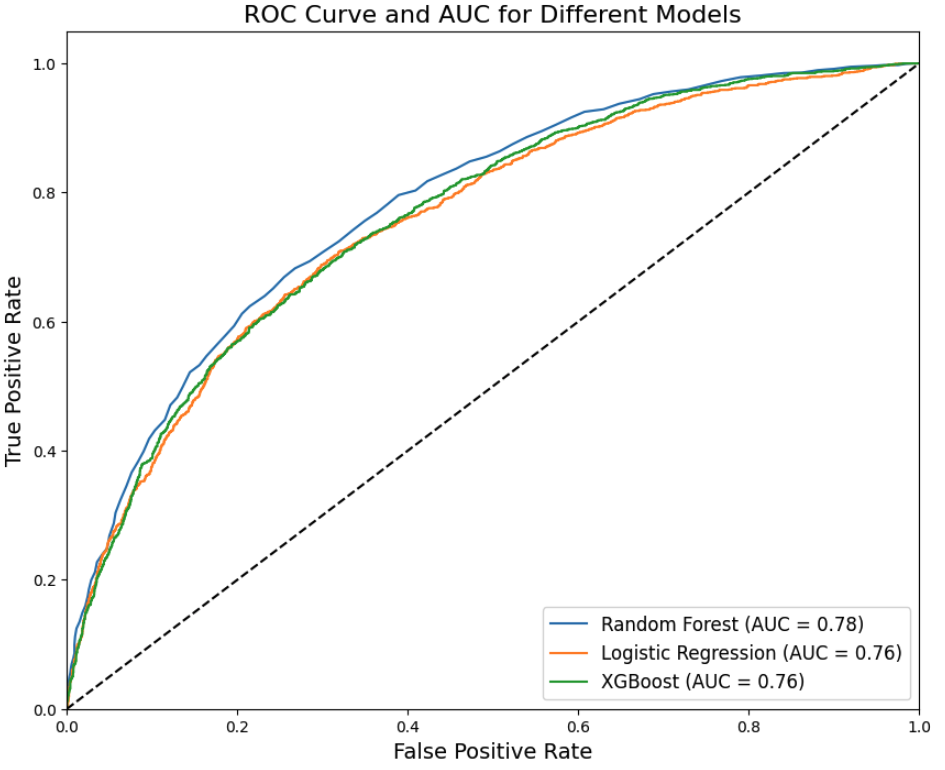

# Employment Bias: Using Machine Learning to Predict Labour Market Discrimination in Europe

**Hertie School of Governance**  
**Master for Data Science for Public Policy**  
**Machine Learning**  
**Professor: Drew Dimmery**

**Authors:**  
[Aranxa Márquez Ampudia](https://github.com/aranxaMarAm), 
[Gayatri Shejwal](https://github.com/gayatri-shejwal),
[Leticia Figueiredo Collado](https://github.com/lefcollado), and
[Monserrat López Perez](https://github.com/monlo) 

## Abstract

Immigrant and minority integration count as one of European Union countries main challenges. With employment finding being a major barrier, this study compares three machine learning models (Binary Logistic Regression, Random Forest and XGBoost) to predict discrimination faced by individuals seeking jobs after resettlement in Europe. Accurate predictions can guide policies and interventions to reduce employment discrimination against immigrants and help improve hiring practices and promote a more inclusive social integration.

## Introduction

Conflict escalation amongst criminal gangs, climate change, authoritarian and repressive governments persecuting minorities, displacements caused by wars, the seek of (better) job opportunities or personal development, whatever the motivation behind migration is, it has and will keep having significant impact in the lives of millions of people. As a consequence to this social phenomenon –thoroughly studied by economists, sociologists and anthropologists– democratic governments, as the ones conforming to the European Union, are required to protect the human rights of immigrants. 

However, the integration of the various groups of people with different cultural and social backgrounds represents one of the main challenges faced by governments in Europe (Guiso, Herrera, Morelli, 2016). One of the main barriers for people to find stability in a new country is to find a job. The process itself, under normal conditions, can be very tedious, demotivating and unpromising, characteristics that tend to worsen in the case of people who are new to the culture and the language. Considering the labor shortage faced by the EU countries in the last decades and their policies to attract and educate skilled workers (European Commission, 2024).

Through a comparison of three different models –Binary Logistic Regression, Random Forest and Extreme Gradient Boosting (through the XGBoost package) this project aims to predict the discrimination faced by individuals while looking for employment after resettlement in Europe. Previous literature review supports the use of this kind of models to find out the probability that a person reports experiencing discrimination to investigate the factors associated with perceived employment-related discrimination (Hahn and Wilkins, 2013).  

Predictions about level of discrimination could be a valuable source for institutions and policy makers to better target interventions aimed at understanding persisting barriers to employment, reducing discrimination and promoting social integration, including access to mental health interventions in case of severe discrimination. It could help policymakers to identify particularly vulnerable communities where discrimination is hampering access to basic rights and quality of life and carry out awareness and sensitization campaigns in regions with higher incidence of discrimination. Additionally, employers and service providers could use these insights to design more inclusive policies and practices, which would also aid productivity in the long run. With this work, we aim to provide better information for predicting vulnerabilities that immigrant and ethnic minority groups face while entering the job market in Europe, and the most important features that policy makers among the Member States need to consider to ensure a better integration for all people in the region.   

## Predicting migrant discrimination while looking for a job

For predicting migrant discrimination while looking for a job we used data from the Second European Union Minorities and Discrimination Survey (EU-MIDIS II, 2016) which contains information about individuals aged 16 or older, with an immigrant or ethnic minority background. Among other things, it contains demographic details as well as various experiences of discrimination as perceived by these individuals, while integrating into the destination country.

The first step of the data cleaning was selecting the target group in the survey. Although the survey was confirmed by around 77,600 household members with 25,515 respondents, as we wanted to measure discrimination while looking for a job, we filtered by the people that were actively looking for a job either at the moment of the survey or in the past 5 years. This filtering reduced the observations to 17.3%, from 77,656 to 13,406. While the label defined in this project is discrimination occurrence, it is important to note that the self-reported job discrimination variables available in the dataset were used as a proxy indicator of discrimination. For the features, demographic information, socioeconomic characteristics, and variables related to experiences discrimination based on respondent's skin color, ethnic origin, religion, harassment experiences or hate-motivated violence we included. 

### Discrimination Data Overview

The European Union is home to a highly diverse population, reflecting centuries of migration flows. As of 2023, the total population across the 28 EU member states stood at 448.4 million inhabitants. However, a significant portion of this population has origins outside the EU. Specifically, 27.3 million residents (6% of the total EU population) were non-EU citizens. An even larger number, 42.4 million people, meaning 9% of all EU inhabitants, were born outside the borders of the European Union. These statistics underscore this region’s position as a major destination for immigrants from around the world. The Second European Union Minorities and Discrimination Survey (EU-MIDIS II, 2016) gives us an overview of how this demographic diversity and their perceptions towards discrimination look like.

Prior to running the predictive models for discrimination, we explored basic statistics of our dataset to better understand the profile of those responding to the survey and the different features of discrimination contained in the responses. Figure 1 shows the distribution of gender, age, religion, ethnic groups and job situation of the respondents. The age mean in the respondents group is 34.9, and the majority of them are men and of Roma and African descent.

<figure style="text-align:center;">
  <figcaption><strong>Figure 1. Basic descriptive statistics.</strong></figcaption>
  
  
</figure>

It is also remarkable that the vast majority of respondents are religious, with the non-religious representing only 11.1% of the whole dataset. Furthermore, people who consider themselves fully unemployed represent 36.3% of the filtered dataset.

From the people that mentioned to have suffered discrimination, Figure 2 displays the distribution of the most common types of discrimination: skin color, ethnic origin, religion or religious beliefs and age discrimination, across eight different age groups. Ethnic origin and skin color being the types of discrimination most mentioned by the respondents.

<figure style="text-align:center;">
  <figcaption><strong>Figure 2.  Skin color, ethnic origin, religion and age discrimination by age groups</strong></figcaption>
  
</figure>

Figure 3 shows the percentage distribution of people who felt discriminated against while looking for a job. In the total of 28 countries where the survey was held (2016), the Czech Republic, Slovakia, Greece and Luxemburg occupy the first four positions, reflecting that more than half of the people searching for work reported being discriminated in some way. It should be noted that most recent reports from Amnesty International (2023) account for this discriminatory attitude in the Czech Republic towards Ukrainian refugees and also towards the Roma community. The countries where people felt less discriminated while searching for work were Poland, Lithuania and Slovenia where below 20% of the respondents reported some kind of discrimination. 

<figure style="text-align:center;">
  <figcaption><strong>Figure 3. Discriminated job applicants by country of interview.</strong></figcaption>
  
</figure>

### Target variable

For constructing our models, we used ‘self-reported discrimination while looking for a job’ as the target variable ‘discrimination_occured’. This binary variable was constructed using 8 different kinds of discrimination types, contained in 8 different variables in the original dataset, and takes the value 0 if the interviewed person did not perceive any type of discrimination, and 1 if they perceived at least one type of discrimination while looking for a job. In our subset, 38.56% of people that were actively looking for a job perceived at least one type of discrimination in this process.

<figure style="text-align:center;">
  <figcaption><strong>Figure 4. Percentages of Perceived Discrimination while looking for a job at the moment of the survey or in the preceding five years </strong></figcaption>
  
</figure>

### Feature Selection and Transformation

Processing the features collected through the EU-MIDIS II 2016 questionnaire was one of the main challenges during the development of our models. The information was presented mostly as categorical insights, several of which we had to transform into different binary and discrete categories. After the initial filtering, as mentioned before, narrowing down the dataset to the relevant 13,406 respondents who were actively looking for a job either at the moment of the survey or in the past 5 years, we began selecting the relevant features and transforming them as it deemed necessary.

We first manually selected about 50 features, on which we performed various kinds of transformations, in addition to removing variables containing 90% or more missing values from the dataset. We also ran feature importance to further select the most relevant ones. This resulted in a total of 29 features, some of which are detailed below. Demographic and socioeconomic features such as age, religion, gender, marital status, income, etc. needed zero or minimal manipulation and they have mostly been left as they are.

<strong> Types of features used </strong>

We used multiple features from broad categories of factors that are likely to impact discrimination faced while looking for work. We have included features that are indicators of:

- **Income and poverty**: which can influence the kinds of jobs a person will look for, and therefore, be likely to face discrimination. This also includes their ability to access housing options and the ability to make ends meet.
- **Religion and ethnicity**: which can lead to discrimination through social prejudices and political ideologies.
- **Age, gender, and marital status**: which also lead to discrimination in various social and economic contexts.
- **Health condition**: which can significantly impact a person’s ability to work and also the type of work they can undertake.
- **Prevalence of discrimination and past experiences**: including institutional experiences involving different types and frequency of discrimination faced, which impact a person’s ability to perceive discrimination.
- The extent of urbanization of a place, the structure of a person’s social circle (integration with other ethnicities), and the presence of support organizations which may impact the discrimination faced.

<strong> Feature transformation </strong>

- For questions with a ‘Yes’ or ‘No’ response, other categories such as ‘Refused to answer’, ‘Did not understand the question’, and ‘Don’t know’ were added to the ‘No’ response – in many cases, these answers were not statistically significant and represented a very small percentage of the answers. In cases where they represented a higher percentage of the total of responses, we looked for other variables in the dataset that could be used instead.
- For variables like past experiences of discrimination of different types (past_discrim_exp), frequency of discrimination based on factors such as skin color, ethnic origin, or immigrant background and religion (extent_of_discrim), awareness of experiences of violence among friends and family (violence_exp_by_family), income through social transfers (social_transfers), etc., the features were not only transformed in the above manner but also combined to engineer a new feature, so as to remove any existing correlation between responses.

Further, there were several features with missing values. As most of these values were discrete in nature, simple imputation using mean was not possible. These were removed using different methods, such as making the feature binary, through simple imputation using most frequent values (used sparingly), and in some cases, by using variables constructed from other features (and by using conditional statements for imputation). The third method was used particularly for binary features like citizenship status (citizenship_status), at-risk of poverty after social transfers (poverty_risk), etc. This was important so as to not bias the features in one direction through simple imputation using mode, and ensured informed assignment to both categories.

<strong> Key challenges which we faced while selecting features </strong>

- There were some features like country of birth, highest level of education, etc. which we wanted to include in our model as we believed that they would have a significant impact on the discrimination faced by a person, but they contained a large number of missing values which could not be imputed and we had to drop them. In the original publicly available dataset, there were several features that were omitted due to the sensitive nature of the data. This included features which would have helped impute the country of birth variable, for example, but unfortunately, we did not have access to those in the public dataset. As an alternative to this, we used the feature indicating target groups which represented broad categories of ethnicities (ethnic_group) instead of nationalities.
- The original dataset contained 1283 features which were mostly categorical, so it was nearly impossible to manually pick the relevant ones. As most of them also contained a large number of missing values, it was not possible to run feature selection on the dataset without first imputing the NAs, so it presented us with a chicken-or-egg problem. The manual feature selection and the subsequent feature transformation/engineering took a lot of our time and effort.

## Model Selection and Evaluation

For predicting discrimination faced by individuals while looking for a job after resettlement, we evaluated three classification models: Logistic Regression, Random Forest, and XGBoost. For training the models we split the data into training and testing sets, using 70% for training and 30% for testing. We constructed a pipeline that included a preprocessor to standardize the features (so that they had a mean of 0 and a standard deviation of 1), using StandardScaler from the scikit-learn package. The pipeline also included our three classifiers: Logistic Regression, Random Forest, and XGBoost. 

### Cross Validation

To evaluate the performance of each model and assess how well the model will perform on unseen data, we used the cross_val_score helper function from the scikit-learn package to perform 5-fold and 10-fold cross-validation. This process helps avoid overfitting by iteratively training and evaluating the models on different subsets of the data. As we can see in the table below, the Random Forest Model had the highest cross-validation accuracy levels for both 5-fold and 10-fold validation (0.722). Increasing the number of folds from 5 to 10 did not significantly impact the Random Forest model's performance, but it led to slight improvements, especially for XGBoost.

| Model               | 5-Fold Cross-Validation | 10-Fold Cross-Validation |
|---------------------|-------------------------|--------------------------|
| Logistic Regression | 0.705                   | 0.706                    |
| Random Forest       | 0.722                   | 0.722                    |
| XGBoost             | 0.713                   | 0.719                    |

### Confusion Matrices

To better understand the quality of the predictions made by our models, we plotted the confusion matrices for each one. A confusion matrix shows the number of correct and incorrect predictions made by the model compared to the actual classifications. The diagonal elements are the points where the predicted label matches the true label, while the  off-diagonal elements represent the false positives and false negatives. As we can see in Figure 5, the model with the highest number of correct predictions is the Random Forest model.

    <figure style="margin-right: 20px; ">
        
    </figure>
    <figure style="margin-right: 20px;">
        
    </figure>
    <figure style="text-align:center;">
        
    </figure>

### ROC Curve and AUC

Finally, to choose the better performing model, we plotted the Receiver Operating Characteristic (ROC) curves and calculated the Area Under the Curve (AUC) for each one. ROC curves use true positive rate (TPR) on the Y axis, and false positive rate (FPR) on the X axis. The top left corner of the plot is the “ideal” point (a FPR of zero, and a TPR of one). AUC values measure the performance of each model across all classification thresholds. The higher the AUC value, the better the model is at distinguishing between positive and negative classes. 
As Figure 6 shows, the Random Forest model has the highest AUC value of 0.78 among the three models, and also was the one with the curve closest to the ideal left corner of the graph. This indicates that it has the best overall performance in distinguishing between the positive and negative classes. 

<figure style="text-align:center;">
  <figcaption><strong>Figure 6. Receiver Operating Characteristic (ROC) curves and calculated the Area Under the Curve (AUC) for each model (Logistic Regression, Random Forest, XGBoost)  </strong></figcaption>
  
</figure>

Based on our evaluation metrics, the Random Forest (RF) model performed better in most of the evaluations than Logistic Regression and XGBoost. It demonstrated higher accuracy and a superior AUC value, making it the preferred choice for predicting job discrimination. 

### Feature Importance

In this section we present the feature importance values obtained from our trained Random Forest model. The feature importance indicates the contribution of each feature to the predictive power of the model. Although we are presenting the results of the final model considered, we performed this step in the feature selection process too, to train our models using the most important features. Figure 7 illustrates the most important features in our final Random Forest model.

<figure style="text-align:center;">
  <figcaption><strong>Figure 7. Feature Importance for Random Forest Model </strong></figcaption>
  
</figure>

<strong> Interpretation </strong>

Key factors influencing the predictions included:
### Past experiences and extent of discrimination
- **Variables**: `past_discrim_exp`, `extent_of_discrim`, `violence_exp_by_family`
- **Insights**: These constructed variables show high importance, indicating that past experiences of harassment strongly predict discrimination. Previous experiences impact perception and logically predict future occurrences.

### Age of the respondent
- **Variable**: `age`
- **Insights**: High importance suggests age-related discrimination significantly affects job searching. Biases against older or younger individuals can lead to unfair treatment and barriers to employment.

### Household income and social transfers
- **Variables**: `household_income`, `social_transfers`
- **Insights**: Higher income correlates with better opportunities, while lower income increases vulnerability to discrimination, compounded for marginalized groups.

### Health condition
- **Variable**: `health_status`
- **Insights**: Health impacts daily activities, leading to biases about productivity and potential discrimination, especially regarding mental health.

### ID
- **Variable**: `respondent_id`
- **Insights**: Although significant, it may be noise, as it lacks contextual information and may cause overfitting. Excluding it only marginally affects accuracy, indicating further investigation is needed.

### Hyperparameter Tuning

To further improve the performance of our chosen Random Forest model, we perform hyperparameter tuning using GridSearchCV, which is a way of iterating through many combinations of hyperparameter values to get the best combination that leads to the best performance. We evaluated different combinations of `n_estimators`, `max_depth`, and `min_samples_split` to find the optimal set of hyperparameters.

- **n_estimators**: The number of trees in the Random Forest. More Trees can improve the model’s performance, but also increase the computational cost. 
- **max_depth**: It is the maximum depth of each tree. While more complex, deeper trees can capture more patterns, but also can lead to overfitting.
- **min_samples_split**: The minimum number of samples to split a node. 

For our Random Forest model, we first used GridSearchCV to explore the following parameters: `n_estimators` of 100, 200, 300; `max_depth` of None, 10, 20, or 30; `min_samples_split` of 2, 5, or 10. With those hyperparameters the best parameters were: `{'max_depth': 10, 'min_samples_split': 2, 'n_estimators': 200}`. The model was retrained with those best hyperparameters found, and we reached a final accuracy of 0.725. 

In a further attempt for improving the accuracy levels, we increased the number of estimators to [50, 100, 200, 300, 400], the max depth to [None, 10, 20, 30, 40, 50], and maintained the min samples split, but the final accuracy remained the same. 

Finally, we tried adding the following additional parameters:
- **min_samples_leaf**: Tuning this parameter helps to ensure that we have a minimum number of samples at each node and can help reduce overfitting (values: 1, 2, 4).
- **bootstrap**: This parameter helps to decide whether to use bootstrap samples or the entire dataset for each tree in the forest (values: True, False).

In this final attempt, that took more computing time, we reached the best parameters: `{'bootstrap': True, 'max_depth': 20, 'min_samples_leaf': 2, 'min_samples_split': 5, 'n_estimators': 300}`. Retraining the model with these best hyperparameters, we reached a slight improvement in the accuracy level, with 0.729.

## Conclusions and Final Thoughts

For predicting migrant’s discrimination while looking for a job in Europe we evaluated three different Machine Learning Classification models: Logistic, Random Forest and XGBoost. Of the three models, the Random Forest Classifier was the best performer, with higher accuracy and superior AUC value, achieving an accuracy of nearly 73% after hyperparameter tuning. While this accuracy level is not exceptionally high, the nature of the data (an applied survey), the incompleteness of the information, and the intrinsic challenge of predicting the complex phenomenon of perceived discrimination can affect this percentage. However, we managed to reach a model with a sufficiently high level of accuracy to make reliable predictions on the European job market discrimination towards minority groups. 

Furthermore, we used the Random Forest model to evaluate the feature importance and understand which factors most influence the model predictions. We found that past experiences and frequency of discrimination, age, income and interviewed country were the most significant predictors in the model. Although feature importance highlights factors more relevant for prediction, not necessarily causal relationships, these results align with existing research highlighting age as one important predictor of labor discrimination. Also, the importance of the country where people were interviewed aligns with the descriptive statistics, where we found that Czech republic, Slovakia, Greece and Luxembourg are countries with high occurrence of migration and discrimination against certain groups, especially towards the Roma population. 
It is important to consider that migration is a complex problem that is continuously evolving, and requires up to date information. However, the current model relies on a survey that the European Union Agency for Fundamental Rights conducted in 2016 and has not been updated since. Enhancing model accuracy can be achieved by incorporating more information into the model. Therefore, a key policy recommendation from this work is to conduct the survey again, to take into account recent events that have recently affected migration in Europe, such as the war in Ukraine.

On the other hand, the accuracy levels of the model can be related to the inherent complexity of studying the minorities perceptions of discrimination in the job market. As already pointed out by Hahn and Wilkins (2013) “perceptions of experience of discrimination may not match actual experience of discrimination, not only because a respondent may believe discrimination exists where it does not, but also because a respondent may not realize that he or she was the victim of discrimination”. Perceptions of discrimination can diverge from reality, yet these subjective views hold significant importance. We rely on perceived discrimination to measure its occurrence, even though people might misjudge its presence or absence. Nonetheless, such perceptions directly influence consequential decisions like human capital investments, labor force participation, and the discussed topic of this project, the job choices.

This attempt demonstrates the potential of machine learning models to analyze discrimination faced by migrants in the job market across the EU member states. By recognizing the limitations and incorporating broader data collection efforts, these models can be refined to provide valuable insights for combating discrimination and guarantee a better integration for minorities in the region.

## References

- Amnesty International. (2023). Czech Republic. [Amnesty International](https://www.amnesty.org/en/location/europe-and-central-asia/western-central-and-south-eastern-europe/czech-republic/report-czech-republic/).
- Chen, T., & Guestrin, C. (2016, August). Xgboost: A scalable tree boosting system. In *Proceedings of the 22nd international conference on knowledge discovery and data mining* (pp. 785-794). [ACM](https://dl.acm.org/doi/pdf/10.1145/2939672.2939785).
- European Commission. (2023). Integration of migrants: EU action. [European Commission](https://ec.europa.eu/migrant-integration/the-eu-and-integration/framework_en).
- European Commission. (2024). Labor shortage in Europe. [European Commission](https://europa.eu/european-union/topics/migration_en).
- Guiso, L., Herrera, H., Morelli, M., & Sonno, T. (2016). Populism: Demand and Supply. *CEPR Discussion Paper No. DP11871*. [CEPR](https://cepr.org/publications/dp11871).
